# INF781 - Seguridad de Software

# Examen 3.er Parcial

## SecureNotes API

### Universidad Autónoma Tomás Frías

**Carrera:** Ingeniería Informática

**Materia:** INF-781 - Seguridad de Software

**Docente:** M. Sc. Huáscar Fedor Gonzales Guzmán

**Proyecto:** SecureNotes API

**Estudiante:** Israel Fuertes

**Gestión:** I - 2026

---

# Descripción

SecureNotes es una API REST desarrollada con **NestJS 11** y **PostgreSQL** que permite a los usuarios administrar notas personales de forma segura.

El sistema implementa mecanismos modernos de autenticación y autorización utilizando JWT, Refresh Tokens, Cookies HttpOnly, Hashing con Argon2 y control de acceso por propietario, cumpliendo con los requisitos establecidos en el examen práctico de Seguridad de Software.

---

# Objetivos del proyecto

* Implementar autenticación segura mediante JWT.
* Gestionar sesiones utilizando Refresh Tokens persistentes.
* Aplicar rotación y detección de reutilización de Refresh Tokens.
* Proteger las rutas mediante Guards.
* Evitar ataques IDOR permitiendo que cada usuario acceda únicamente a sus propias notas.
* Implementar buenas prácticas de seguridad en el almacenamiento de credenciales.

---

# Tecnologías utilizadas

| Tecnología      | Versión |
| --------------- | ------- |
| NestJS          | 11      |
| Node.js         | 20+     |
| PostgreSQL      | 14+     |
| TypeORM         | Última  |
| Passport JWT    | Última  |
| JWT             | Última  |
| Argon2          | Última  |
| Class Validator | Última  |
| Cookie Parser   | Última  |

---

# Instalación

## 1. Clonar el proyecto

```bash
git clone https://github.com/IsraelFuertes/inf781-examen-securenotes.git
```

---

## 2. Instalar dependencias

```bash
npm install
```

---

## 3. Configurar el archivo .env

Tomar como referencia el archivo:

```text
.env.example
```

Crear un archivo llamado:

```text
.env
```

Ejemplo:

```env
DB_HOST=localhost
DB_PORT=5432
DB_USERNAME=postgres
DB_PASSWORD=postgres
DB_DATABASE=securenotes

JWT_ACCESS_SECRET=CAMBIAR_POR_UNA_CLAVE_SUPER_SECRETA_123456789
JWT_REFRESH_SECRET=OTRA_CLAVE_SUPER_SECRETA_987654321

JWT_ACCESS_EXPIRES=15m
JWT_REFRESH_EXPIRES=7d
```

---

## 4. Crear la base de datos

Crear una base de datos llamada

```text
securenotes
```

---

## 5. Ejecutar el proyecto

```bash
npm run start:dev
```

La API estará disponible en

```
http://localhost:3000
```

---

# Arquitectura

```
Cliente (Postman)

        │

        ▼

NestJS API

        │

 JWT + Guards

        │

 TypeORM

        │

 PostgreSQL
```

---

# Endpoints implementados

## Autenticación

| Método | Endpoint       |
| ------ | -------------- |
| POST   | /auth/register |
| POST   | /auth/login    |
| POST   | /auth/refresh  |
| POST   | /auth/logout   |
| GET    | /auth/me       |
| GET    | /auth/sessions |

---

## Notas

| Método | Endpoint   |
| ------ | ---------- |
| POST   | /notes     |
| GET    | /notes     |
| GET    | /notes/:id |
| PATCH  | /notes/:id |
| DELETE | /notes/:id |

---

# Funcionalidades implementadas

## Autenticación

* Registro de usuarios.
* Inicio de sesión.
* JWT Access Token.
* Refresh Token.
* Refresh Token mediante Cookie HttpOnly.

---

## Gestión de sesiones

* Persistencia de Refresh Tokens.
* Hash del Refresh Token.
* Rotación automática.
* Reutilización detectada.
* Revocación de sesiones.
* Logout.
* Listado de sesiones activas.

---

## Seguridad

* Contraseñas protegidas mediante Argon2.
* Refresh Tokens protegidos mediante Argon2.
* Guards JWT.
* ValidationPipe.
* DTOs.
* Control de acceso.
* Protección contra IDOR.

---

## CRUD de Notas

* Crear nota.
* Listar notas.
* Obtener nota.
* Actualizar nota.
* Eliminar nota.

---

# Evidencias de funcionamiento

## 1. Registro de usuario

**Descripción**

Se registra correctamente un nuevo usuario y se genera el Access Token correspondiente.

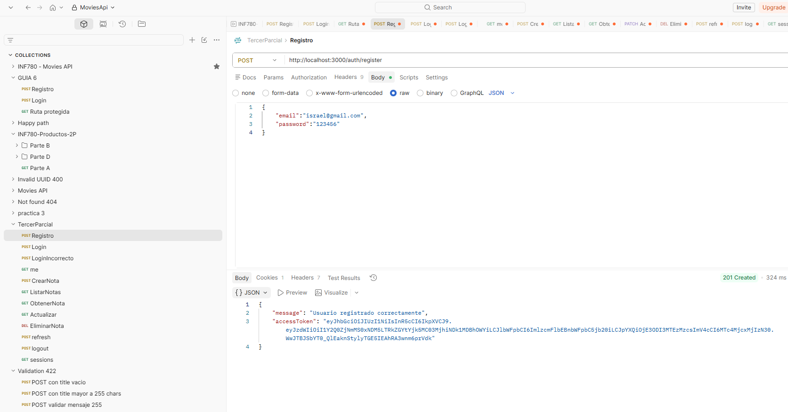

---

## 2. Inicio de sesión

**Descripción**

El usuario inicia sesión correctamente. El Access Token es devuelto y el Refresh Token es almacenado como Cookie HttpOnly.

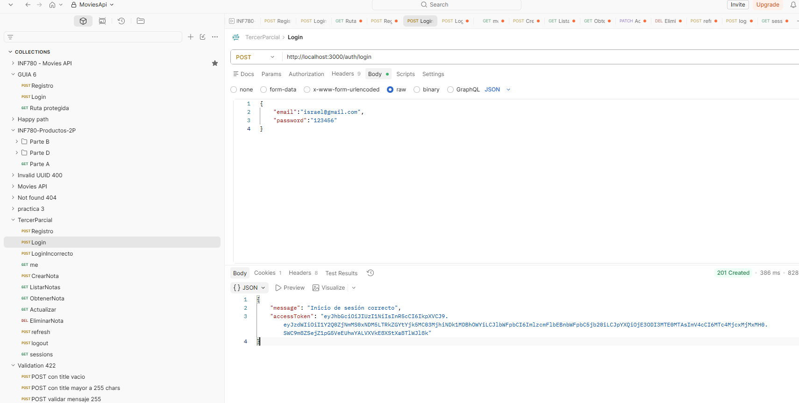

---

## 3. Cookie HttpOnly

**Descripción**

Se verifica que el Refresh Token se encuentra almacenado como Cookie HttpOnly en Postman.

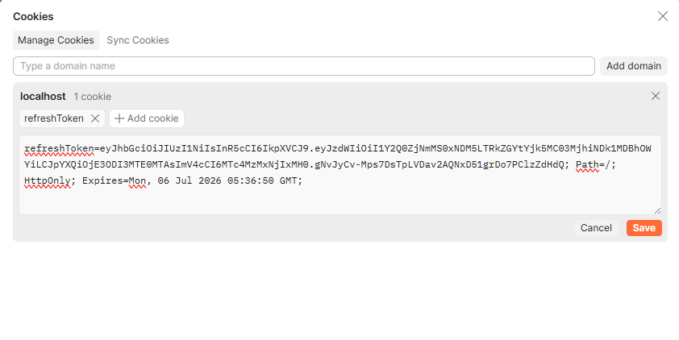

---

## 4. Información del usuario

**Descripción**

El endpoint `/auth/me` devuelve correctamente la información del usuario autenticado.

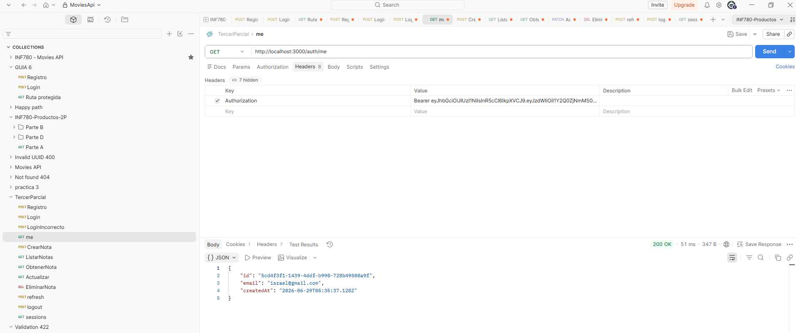

---

## 5. Crear nota

**Descripción**

Se crea correctamente una nueva nota perteneciente al usuario autenticado.


---

## 6. Listar notas

**Descripción**

El sistema muestra únicamente las notas del usuario autenticado.

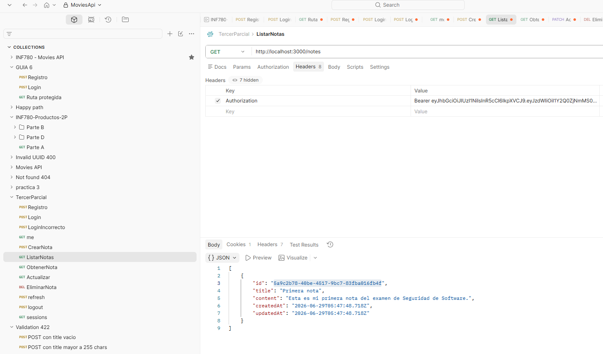

---

## 7. Actualizar nota

**Descripción**

Se modifica correctamente una nota existente.

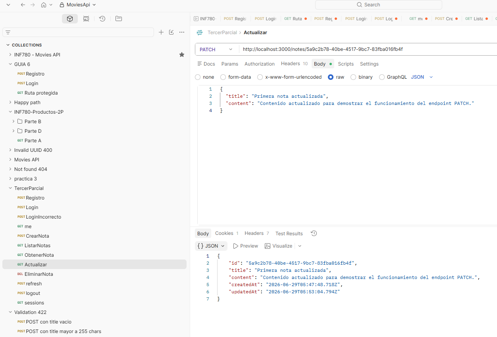

---

## 8. Eliminar nota

**Descripción**

La nota es eliminada correctamente del sistema.

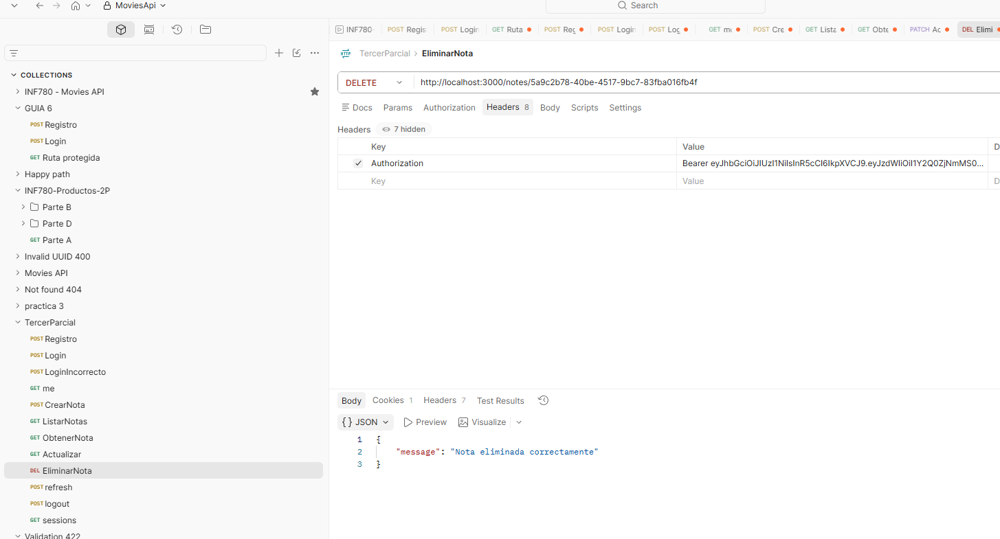

---

## 9. Ruta protegida

**Descripción**

Una petición sin Access Token devuelve correctamente el código **401 Unauthorized**.

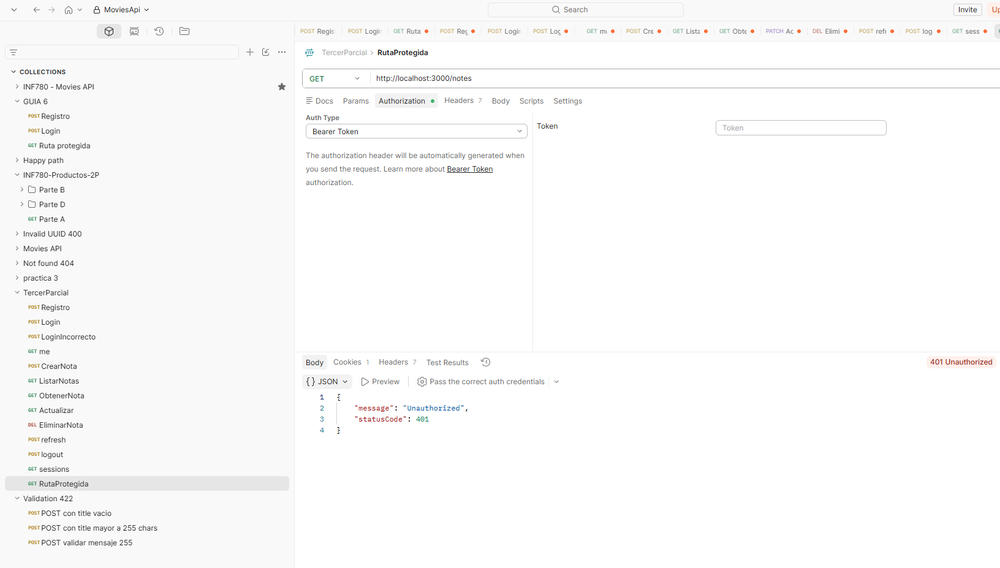

---

## 10. Protección IDOR

**Descripción**

Un usuario intenta acceder a una nota perteneciente a otro usuario y el sistema responde con **404 Not Found**.

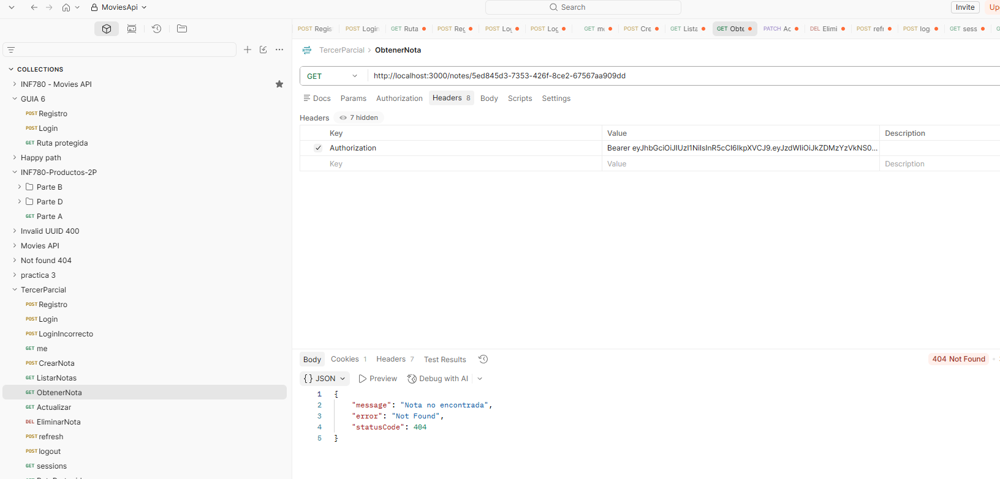

---

## 11. Refresh Token

**Descripción**

Se obtiene un nuevo Access Token utilizando el Refresh Token almacenado en la Cookie HttpOnly.

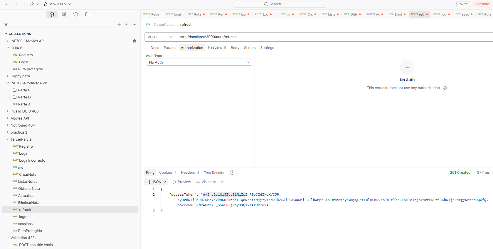

---

## 12. Reuse Detection

**Descripción**

Al reutilizar un Refresh Token previamente rotado, el sistema detecta el intento de reutilización, responde con **401 Unauthorized** y revoca todas las sesiones activas del usuario.

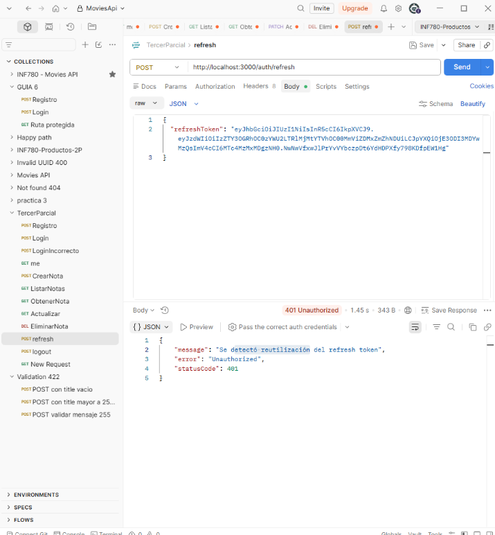

---

## 13. Logout

**Descripción**

El usuario cierra sesión correctamente y la sesión queda revocada.

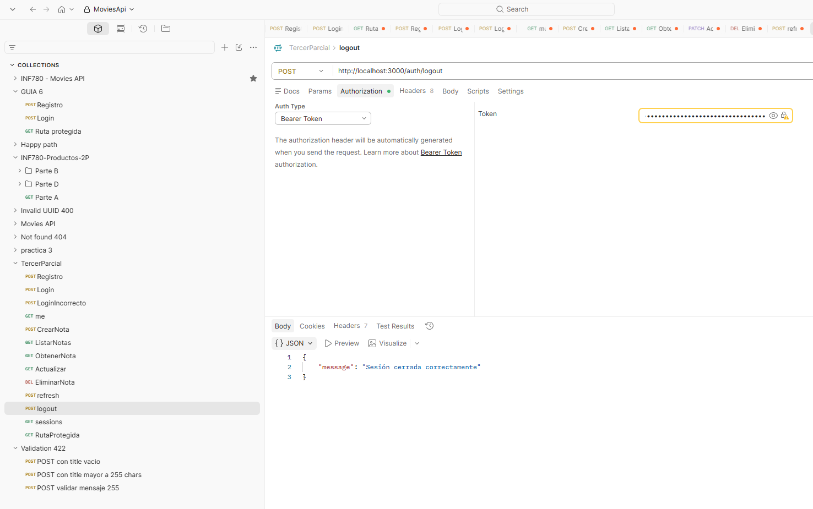

---

## 14. Sesiones activas

**Descripción**

El endpoint `/auth/sessions` muestra las sesiones activas del usuario.

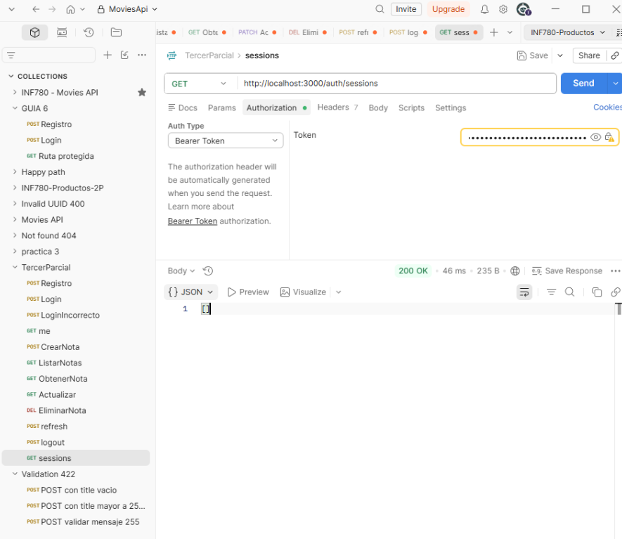

---

## 15. Base de datos PostgreSQL

**Descripción**

Se muestran las tablas utilizadas por el proyecto y los registros generados durante las pruebas realizadas.

### Tabla users

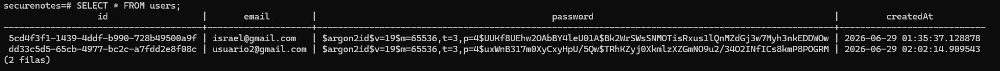

### Tabla notes

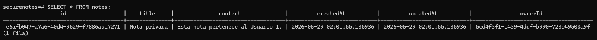

### Tabla refresh_tokens

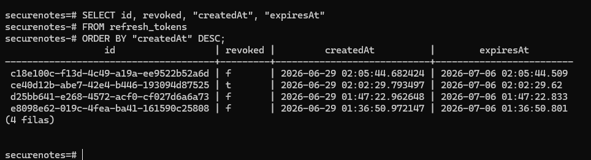

---

# Buenas prácticas implementadas

* Contraseñas hasheadas con Argon2.
* Refresh Tokens hasheados.
* Variables sensibles almacenadas en `.env`.
* Archivo `.env.example` incluido.
* `.gitignore` configurado.
* Cookies HttpOnly.
* JWT Access y Refresh con secretos diferentes.
* Protección de rutas mediante Guards.
* Control de acceso por propietario.
* Rotación de Refresh Tokens.
* Detección de reutilización.
* Revocación de sesiones.

---

# Conclusiones

Durante el desarrollo del proyecto se implementó una API REST segura aplicando los mecanismos de autenticación y gestión de sesiones estudiados en la asignatura. Se integró JWT para autenticación, Refresh Tokens persistentes con rotación y detección de reutilización, además del uso de Cookies HttpOnly para mejorar la seguridad de las sesiones.

Asimismo, se implementó un control de acceso por propietario para impedir accesos no autorizados a recursos de otros usuarios, garantizando el cumplimiento de los principios de confidencialidad e integridad de la información.

Finalmente, el proyecto cumple con los requisitos funcionales y de seguridad establecidos en el examen práctico de la materia INF-781 Seguridad de Software.
